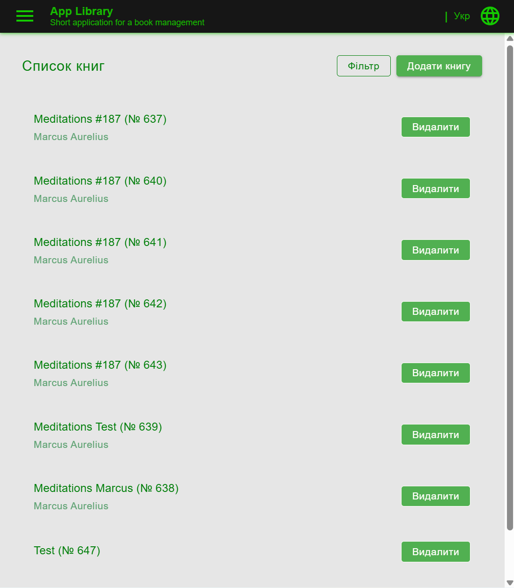
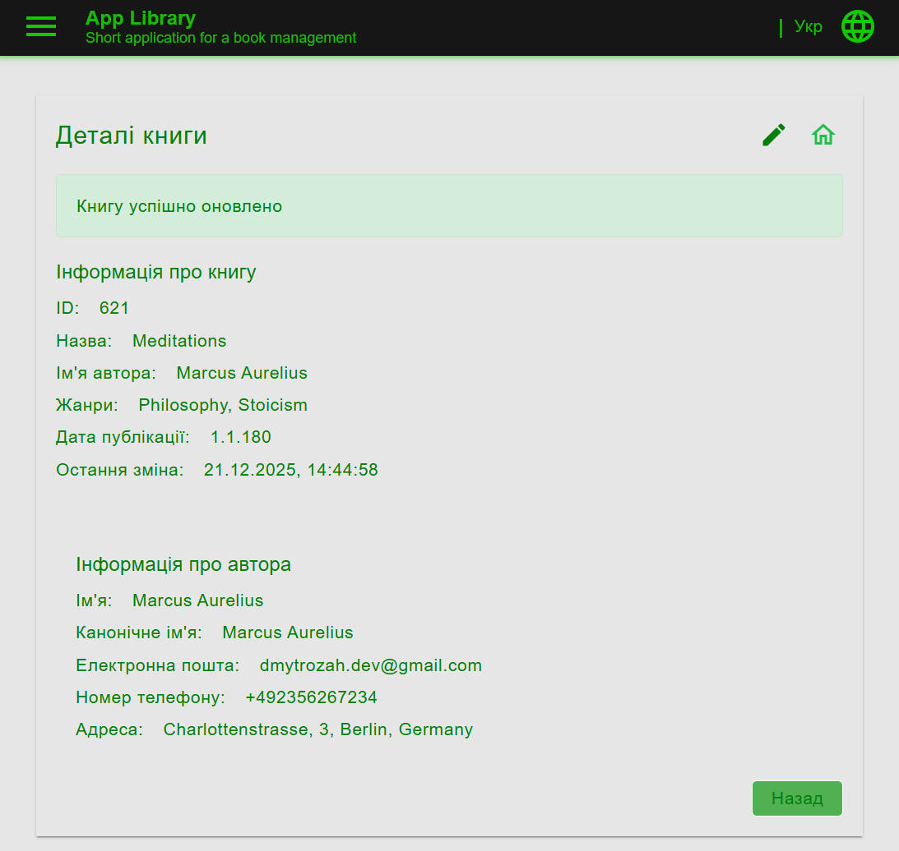
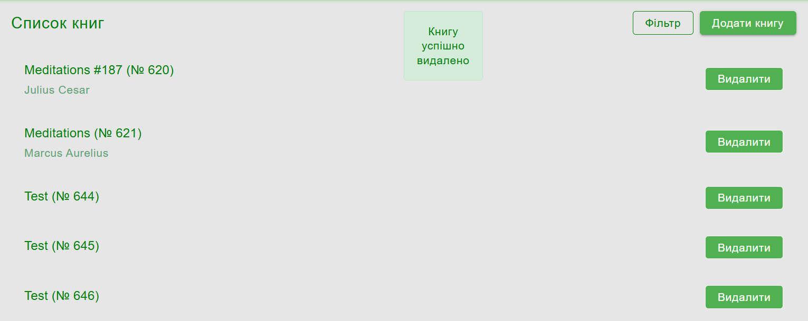
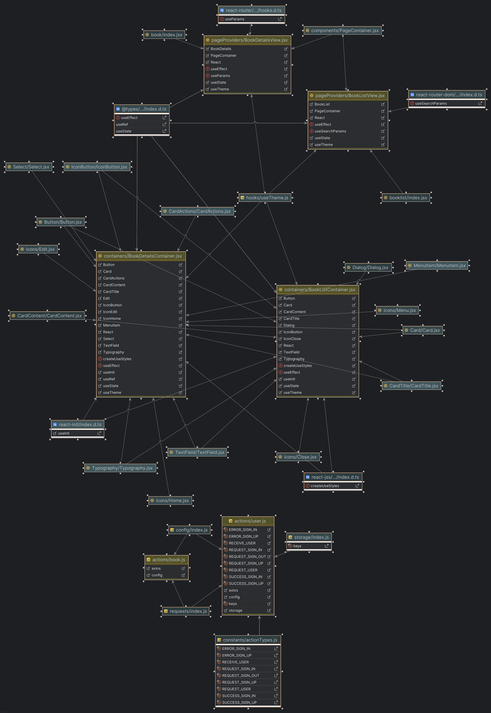

## PS_Task_3

This project features one of the applications developed under the guidance and mentoring during an internship at the company ProfItSoft, the winter fall 2025.

### Objective
In this project we should use the capabilities of `React` for the frontend part and `Java` for the backend part to create a service for book details management.

### Requirements
There are functional and technical requirements that must be complied with, short overview of which is provided below.

#### Functional requirements:
1. We should add two new pages that are accessible via URL:
    - **List of entities**
    - **Entity detailed information**

2. The first page should be the **List of entities** that were created in the previous tasks.
    1. Each entity in the list should display only a few main fields (for example, the entity name and its value such as price/weight/quantity).
    2. When hovering the mouse cursor over an entity, a **Delete** icon button (trash bin) should appear on the right side.
        - Clicking this button should open a confirmation dialog.
        - After confirmation and successful deletion, the dialog should close, the entity should be removed from the list, and a user-friendly success message should be shown and automatically disappear after a certain time.
        - If an error occurs during deletion, the dialog should remain open and an error message should be displayed to the user.
    3. When clicking on an entity in the list, navigation to the **Entity detailed information** page should occur within the same browser window.
    4. In a user-friendly place, we should add an **Add entity** button.
        - Clicking this button should navigate the user to the **Entity detailed information** page in edit mode, where all fields are empty.
    5. In a user-friendly place, we should add a **Filter** button with two or more fields that can be used to filter the list of entities.
    6. The list of entities should support pagination.
    7. After a page reload, the applied filters and pagination state should not be reset.

3. The second page should be the **Entity detailed information** page.
    1. This page should support two modes: **View** and **Edit**.
    2. When a user opens this page, it should be opened in **View** mode by default.
        - In this mode, all available entity fields should be displayed in a convenient format.
        - In the top-right corner, there should be an **Edit** icon button (pencil).
        - Clicking this button should switch the page to **Edit** mode, where all entity fields can be edited.
        - In Edit mode, **Save** and **Cancel** buttons should be displayed.
        - Clicking **Save** should send the updated fields to the backend.
            - On successful save, the page should return to **View** mode and display the updated values, and a success message should be shown and disappear after some time.
            - If an error occurs, the page should remain in **Edit** mode and an error message should be shown.
    3. We should add UI validation for fields at our discretion.
        - Validation should be triggered when clicking the **Save** button.
        - Invalid fields should be highlighted, and no request should be sent to the backend until all fields pass validation.
    4. If a user switches to Edit mode, changes some fields, and then clicks **Cancel**, the entity should return to **View** mode with the previous values.
    5. If the page is opened for creating a new entity, it should open immediately in **Edit** mode.
        - The buttons should be named **Create** and **Cancel**.
        - Clicking **Create** should follow the same flow as saving during editing.
        - Clicking **Cancel** should navigate the user back to the **List of entities** page.
    6. In a user-friendly place, we should add a **Back** button.
        - Clicking this button should navigate back to the **List of entities** page, while preserving the previously applied filters and pagination.

#### Technical requirements:

1. We should implement entity filtering on the backend side.
2. We should implement entity pagination on the backend side.
3. The applied filters and pagination state should be preserved via URL parameters or another backend-supported mechanism so they persist after page reloads and navigation.

### Implementation

- The following views were introduced: `BookDetailsView`, `BookListView`, as well as the following actions: `book.js`, `author.js`.
- The following containers were introduced: `BookDetailsContainer`, `BookListContainer`.
- A clear structure was maintained to separate `containers`, `views` and `actions`.
- A separate component `EditIcon` was introduced to comply with the functional requirements.

### Building the application
Use the task `npm run start` running the application from the root dir.

### Dependency diagrams (UMLs)
